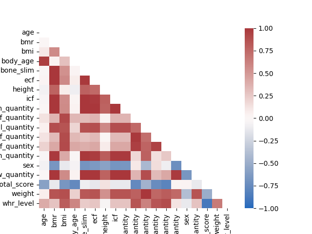
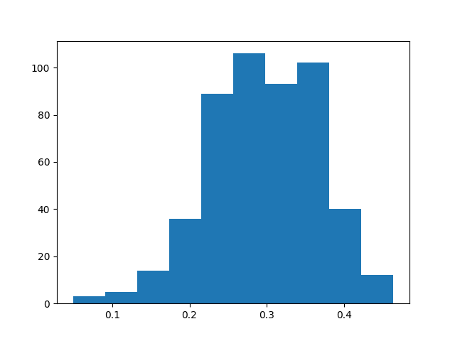
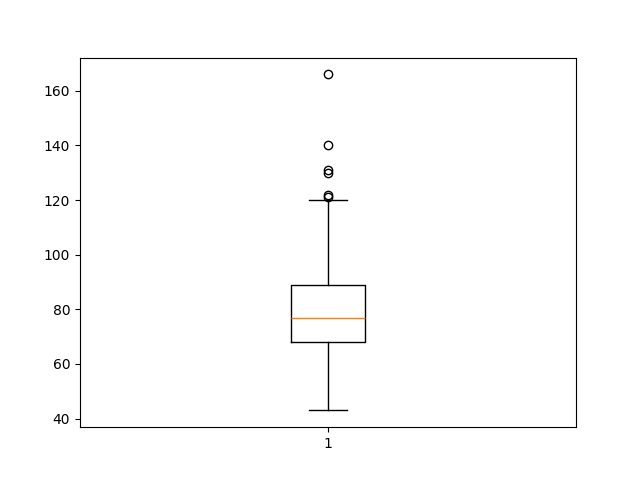
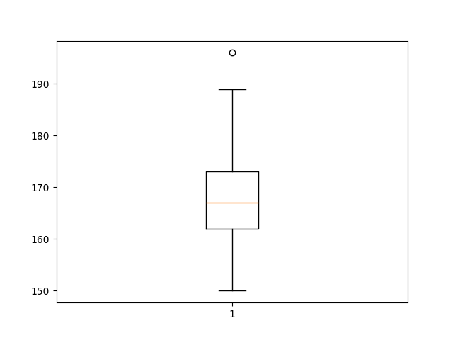
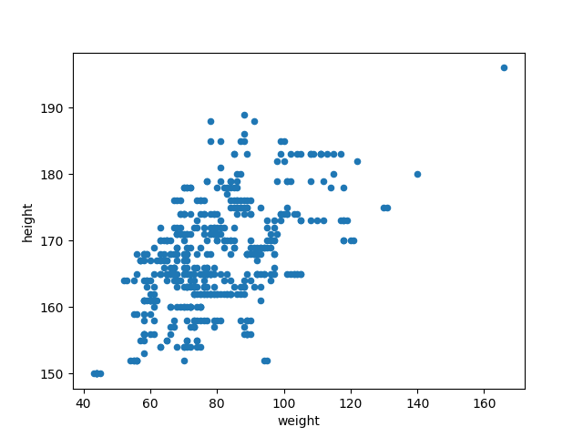

# Introduction
This repository generates a dashboard to assess the quality of a dataset and analyse specific measurements within the data. A PostgreSQL database is built in a Dockerised Linux environment to run data quality tests. The visualisations were generated using the matplotlib Python module.

For simplicity, the project was conducted with PostgreSQL in a Dockerised container and a Python script. The use of dbt was considered, but ultimately not pursued for the sake of this exercise.

# Requirements
This workflow has the following requirements:
- Docker (postgres image version is pinned to '11.22-bullseye')
- WSL (if using Windows)
- Python 3.11 or higher

# Components of the workflow in this repo
There are three main components to this workflow.
1. A PostgreSQL database was created in a Docker container. The sample data (member_scans.csv) were ingested using Pandas DataFrame. The database was used to execute data quality checks.
2. SQLAchemy, with a Psycopg2 adapter, was used to execute the SQL queries and handle the data as Python objects.
3. Pandas DataFrame and Matplotlib were leveraged to generate the visualisations.

The output can be found in the 'assessment-results.py' file. The SQL scripts can be found in the 'sql' folder. The output from the solution is explained in [Results from the Tests and Viusalisations](#results-from-the-tests-and-viusalisations).

# Executing workflow
To execute the workflow, perform the following steps:
1. It is recommended that a Python virtual environment be created in the root folder of this repo.

2. OPTION: If using a Linux OS, run the following command to ensure line endings are in Unix-style:

	$ dos2unix run-me.sh

3. OPTION: If using Windows, open Docker Desktop

4. Run the following bash script:

	$ bash run-me.sh

	This script performs the following actions. If the bash command above does not execute properly, these actions can be run individually and in the order they appear to achieve the same outcome.

		A. Pull PostgreSQL image from Docker Hub

		B. Create and run a Docker container named 'postgresContainer' using the PostgreSQL Docker image. The container is assigned to port 5432 with the basic password: pass123

		C. pip install Python requirements

		D. Run Python script to generate results for Tests and Viusalisations

		E. Stop Docker container

		F. Remove Docker container

# Data quality issue: Duplicate field
There is a duplicate field 'bone_slim_top' in the 'member_scans.csv' sample file. The duplicate fields are identical; therefore, only the first of the two was ingested.

# Results from the Tests and Viusalisations
The results of each Test and Visualisation can be found in the 'results' folder. The outcomes and approaches used for each Test and Visualisation are described below.
## Tests
1. Data Integrity and 4. Data Completeness

	SQL script: test-integrity-completeness.pgsql

	There are no Data Integrity of Data Completeness violations.

	The Data Integrity Test and Completeness Test are completed with the same solution. The query returns any row that has missing values in the columns that correspond to the fields in the 'result sheet'. The results of this query display the full record of any id that has a missing (NULL) or blank ('') value for any field.

2. Range Validation

	SQL script: test-range-violation.pgsql

	There are no Range Validation violations.

	Create a flag to indicate whether body fat percentage is between 0% to 100% in the %BF Validation field. This produces a separate row per error if an id record possesses more than one error.

	Given the age range of the sample (16-59 years), it is assumed that weight between 30kg and 200kg and height between 1m and 2m are within "realistic bounds". A flag (Y/N) is created to indicate whether weight (Weight Validation) or height (Height Validation) are invalid.

3. Outlier Detection

	SQL script: test-outlier-detection.pgsql, test-outlier-summary.pgsql

	There are 2083 instances where client measurements are outside the upper and lower limits. These instances are quantified per measurement type below. The individual records and their errors can be found in the CSV file './results/outlier-detection'.
		,Metric Type,count
		0,Body fat mass,387
		1,Lean body mass,327
		2,Mineral,404
		3,Protein,348
		4,Skeletal muscle mass,313
		5,Total body water,304

	Each query in 'test-outlier-detection.pgsql' returns the id for every record where the 'quantity' value for each body composition metric is outside the 'low_limit' and 'top_limit'. This produces a list of records to investigate the source of the incorrect measurement.
	
5. Correlation Matrix

	SQL script: test-correlation-matrix.pgsql

	A heatmap is used to visualise the correlations between the various client measurements. The upper and lower limits are excluded for easier digestion of the findings. BMI is calculated and included in the correlation matrix.

	There were high correlations where expected in the basic body composition metrics. For instance, weight and height are highly correlated and weight is highly correlated with BMI. In this sample, height did not correlate strongly with BMI, which is consistent with previous findings (Diverse Populations Collaborative Group, 2005).

		Diverse Populations Collaborative Group. (2005). Weight‐height relationships and body mass index: some observations from the diverse populations collaboration. American journal of physical anthropology, 128(1), 220-229.

	

## Visualisations
Visualisations were derived in 'assessment-results.py'
1. Histogram of Body Fat Percentage

	The body fat percentage of the sample was normally distributed around 30% with a slight, negative skew.

	
	
2. Box Plot of Weight and Height

	Weight

	There were several outliers above the upper limit in the weight box plot.

	

	Height

	There was one positive outlier above the upper limit in the height box plot.

	

3. Scatter Plot of Weight vs. Height

	The scatter plot reflects the positive, linear relationship between weight and height from the correlation matrix. The height outlier can be clearly seen in the top right corner of the figure below.
	
	